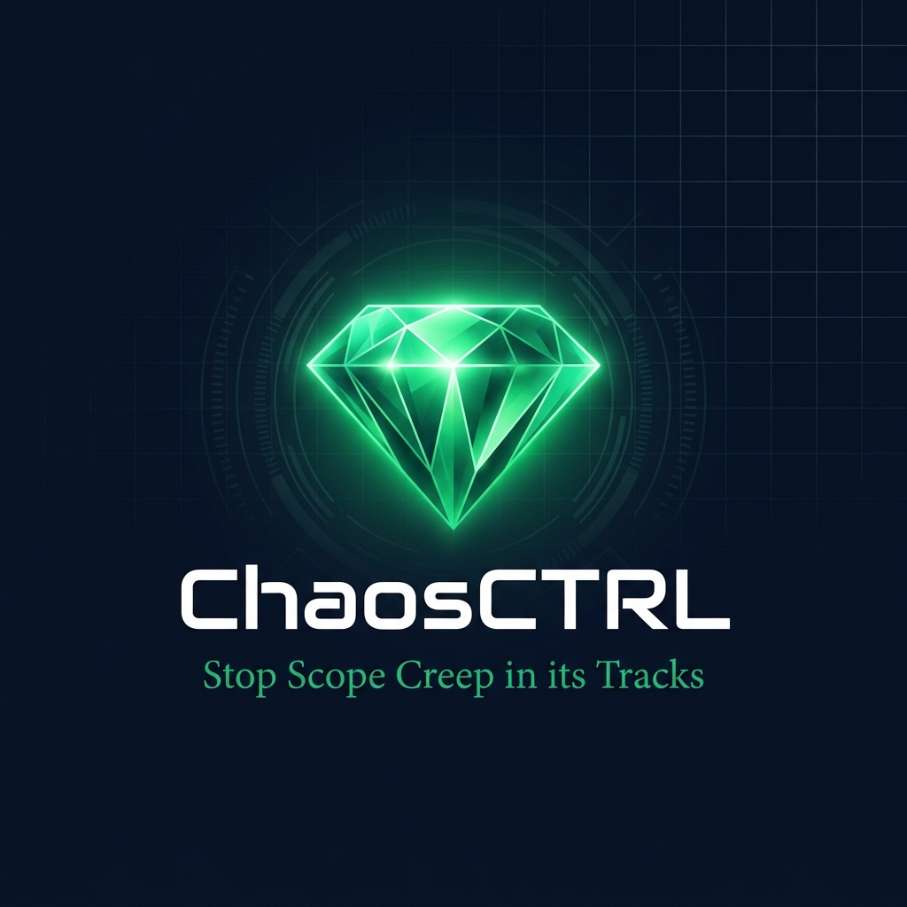

<div align="center">
  
  <br />
  <br />
  
  <a href="https://Reql1337.github.io/ChaosCTRL/">
    
  </a>

  <br />
  <h1><b>ChaosCTRL</b></h1>
  <p><i>Stop Scope Creep in its Tracks. Quantify impact, score turbulence, and simulate futures.</i></p>

  <p>
    
    
    
    
    
  </p>
</div>

---

## ⚡ Overview

**ChaosCTRL** is a state-of-the-art project management layer designed to eliminate the uncertainty of software delivery. It integrates deeply with your existing issue trackers to provide real-time risk assessment, complexity scoring, and timeline simulations.

---

## 🚀 Key Features

### 🔍 Real-time Scope Monitoring
Instant integration with your workflow. Every new ticket or 'quick ask' is automatically analyzed for potential scope creep.

### 🧪 Complexity Scoring (Chaos Score)
Quantitative risk assessment for every task. Every ticket gets a score based on dependency depth and historical sprint data to flag high-risk "minor tweaks" before they derail your release.

### ⏳ Delay Simulator
Visualize the ripple effect of new requests. ChaosCTRL simulates the impact of adding tasks mid-sprint, showing you exactly how many days your final deadline will shift.

### 📊 Impact Visualization
Beautiful, interactive dashboards using **Recharts** and **Framer Motion** to visualize sprint health and velocity.

---

## 🛠️ Tech Stack

- **Frontend**: React 19, Vite, TypeScript, Tailwind CSS
- **Frameworks**: Framer Motion, Recharts, Lucide Icons
- **Backend/AI Core**: Supabase, Advanced Large Language Models (LLM) for complexity analysis

---

## 🚦 Getting Started

### Prerequisites

- [Node.js](https://nodejs.org/) (v18 or higher)
- [Supabase Account](https://supabase.com/)
- [AI API Key](https://ai.google.dev/) (For Complexity Scoring)

### Installation

1. **Clone & Install**
   ```bash
   git clone https://github.com/Reql1337/ChaosCTRL.git
   cd ChaosCTRL
   npm install
   ```

2. **Environment**
   Add your keys to `.env.local`:
   - `VITE_SUPABASE_URL`
   - `VITE_SUPABASE_ANON_KEY`
   - `VITE_GEMINI_API_KEY`

3. **Run**
   ```bash
   npm run dev
   ```

---

## 🚀 Deployment

This project is automatically deployed to **GitHub Pages** via a GitHub Action on every push to the `main` branch. 

> [!NOTE]
> Make sure to add `VITE_GEMINI_API_KEY`, `VITE_SUPABASE_URL`, and `VITE_SUPABASE_ANON_KEY` to your **GitHub Repository Secrets** for the live demo to function correctly.

---

<div align="center">
  <p>Built with 💚 for chaotic project managers everywhere.</p>
</div>
